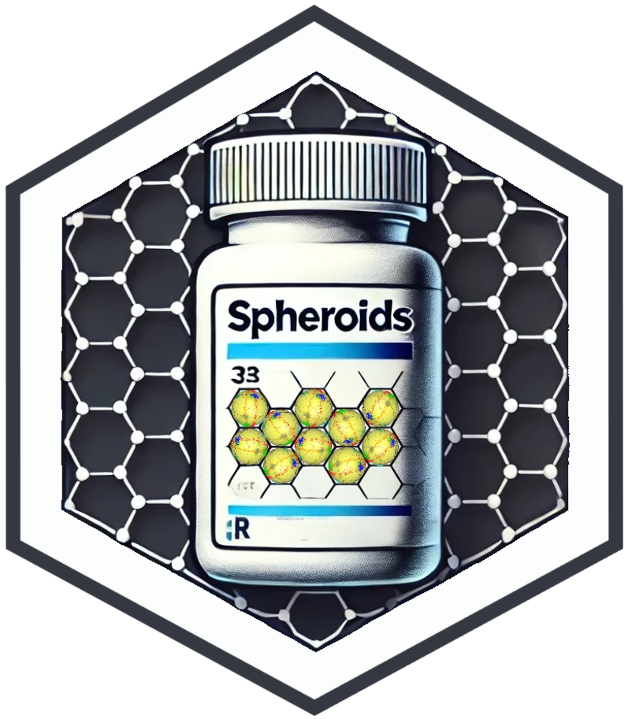

<div align="center">
  

  # Spheroids

  [](https://www.python.org/downloads/)
  [](https://opensource.org/licenses/GPL-3.0)
  [](https://pytorch.org/)
  [](https://github.com/lsablica/spheroids/issues)
  [](http://makeapullrequest.com)

  *High-performance spherical clustering with PyTorch and C++*

  [Key Features](#key-features) •
  [Installation](#installation) •
  [Quick Start](#quick-start) •
  [Documentation](#documentation) •
  [Contributing](#contributing)

</div>

---

Spheroids offers the use of [PKBD](https://www.tandfonline.com/doi/full/10.1080/10618600.2020.1740713) and [spherical Cauchy distributions](https://projecteuclid.org/journals/bernoulli/volume-26/issue-4/Some-properties-of-a-Cauchy-family-on-the-sphere-derived/10.3150/20-BEJ1222.full), which—unlike many other spherical distributions—avoid complicated normalizing constants involving hypergeometric functions and hence do not require iterative evaluations. Instead, they primarily rely on matrix multiplication, making them well-suited for GPU-accelerated computing. 

The package provides **two EM-based estimation methods**:
- A **direct approach** (C++ backend) when no covariates are available  
- A **deep learning approach** (PyTorch backend) for model-based clustering in an embedding space with covariates  

Furthermore, Spheroids includes options to **regularize the number of clusters** using an L1 norm (via a Hadamard product approach inspired by [Ziyin and Wang](https://proceedings.mlr.press/v202/ziyin23a.html)) and can **dynamically drop clusters** whose total weight falls below a user-specified threshold (`min_weight`).


## Key Features  

🚀 **High Performance**
- Core computations implemented in C++ with Armadillo
- GPU acceleration via PyTorch
- Efficient batch processing

🎯 **Multiple Distributions**
- Poisson kernel-based Distribution (PKBD) 
- Spherical Cauchy distribution
- Extensible architecture for new distributions

📊 **Clustering Capabilities**
- Automatic cluster number selection
- Robust parameter estimation
- Support for high-dimensional data

# Installation

### Quick Install (Recommended)

You can install Spheroids directly from PyPI with precompiled wheels:

```bash
pip install spheroids
```

### Advanced Installation (Local Compilation)

For users who want to build the package locally (e.g., to modify the codebase), follow these steps:

#### Prerequisites
- Python ≥3.8
- C++ compiler with C++17 support
- [Armadillo](http://arma.sourceforge.net/) installed

#### Steps

##### On Linux

```bash
# Install required libraries
sudo apt-get update
sudo apt-get install -y libarmadillo-dev libomp-dev

# Clone the repository
git clone https://github.com/lsablica/spheroids.git
cd spheroids

# Build and install
pip install -e .
```

##### On macOS

```bash
# Install required libraries
brew update
brew install armadillo libomp

# Configure compiler paths (if necessary)
export CXXFLAGS="-Xpreprocessor -fopenmp -I/opt/homebrew/opt/libomp/include -I/opt/homebrew/opt/armadillo/include"
export LDFLAGS="-L/opt/homebrew/opt/libomp/lib -lomp -L/opt/homebrew/opt/armadillo/lib"

# Clone the repository
git clone https://github.com/lsablica/spheroids.git
cd spheroids

# Build and install
pip install -e .
```

##### On Windows

```bash
# Clone vcpkg for managing C++ libraries
git clone https://github.com/microsoft/vcpkg.git C:\vcpkg
cd C:\vcpkg
.\bootstrap-vcpkg.bat -disableMetrics
.\vcpkg.exe install armadillo

# Clone the repository
git clone https://github.com/lsablica/spheroids.git
cd spheroids

# Build and install
pip install -e .
```

## Quick Start

```python
import torch
from spheroids import SphericalClustering

# Prepare your data (normalize to unit sphere)
X = torch.randn(1000, 3)
X = X / torch.norm(X, dim=1, keepdim=True)
Y = torch.randn(1000, 2)
Y = Y / torch.norm(Y, dim=1, keepdim=True)

# Create and fit model
model = SphericalClustering(
    num_covariates=3,
    response_dim=2,
    num_clusters=3,
    distribution="pkbd"
)

# Fit model
ll = model.fit(X, Y, num_epochs=100)
```

## Using C++ Implementations

Access optimized C++ implementations directly:

```python
from spheroids import PKBD

# Generate random samples 
samples = PKBD.random_sample(
    n=100,
    rho=0.5,
    mu=np.array([1.0, 0.0])
)

# Calculate log-likelihood
loglik = PKBD.log_likelihood(data, mu, rho)
```

## API Reference

### SphericalClustering

```python
SphericalClustering(
    num_covariates: int,     # Number of input features
    response_dim: int,       # Dimension of response variables
    num_clusters: int,       # Initial number of clusters
    distribution: str,       # "pkbd" or "spcauchy"
    min_weight: float = 0.05 # Minimum cluster weight
)
```

### Key Methods

```python
# Fit the model
model.fit(
    X: torch.Tensor,        # Input features (N x num_covariates)
    Y: torch.Tensor,        # Response variables (N x response_dim)
    num_epochs: int = 100,  # Number of training epochs
    lr: float = 1e-3       # Learning rate
)

# Get cluster predictions
pred = model.predict(X)
```

## Examples

<details>
<summary>Basic Clustering Example</summary>

```python
import torch
from spheroids import SphericalClustering

#load data 
Y = np.load('spheroids/spheroids/datasets/pkbd_Y.npy')

# Create model
model = SphericalClustering(num_covariates= 1, 
                            response_dim= 4, 
                            num_clusters=3, 
                            device="cpu", 
                            min_weight=0.02, 
                            distribution="pkbd")

# Fit without covariates
mu, rho = model.fit_no_covariates(Y, num_epochs= 200, tol= 1e-8)
```
</details>

<details>
<summary>Usage of C++ API</summary>

```python
from spheroids import PKBD, spcauchy

# PKBD distribution
pkbd_samples = PKBD.random_sample(1000, 0.5, mu)
pkbd_loglik = PKBD.log_likelihood(data, mu, rho)

# Spherical Cauchy distribution
scauchy_samples = spcauchy.random_sample(1000, 0.5, mu)
scauchy_loglik = spcauchy.log_likelihood(data, mu, rho)
```
</details>

## Contributing

We welcome contributions! Here's how you can help:

1. 🐛 [Report bugs](https://github.com/lsablica/spheroids/issues)
2. 💡 [Suggest features](https://github.com/lsablica/spheroids/issues)


## License

This project is licensed under the GPL-3.0 License - see the [LICENSE](LICENSE) file for details.

## Citation

If you use Spheroids in your research, please cite:

```bibtex
@software{spheroids,
  title = {spheroids: A Python Package for Spherical Clustering Models},
  author = {Lukas Sablica},
  year = {2025},
  url = {https://github.com/lsablica/spheroids}
}
```

---
